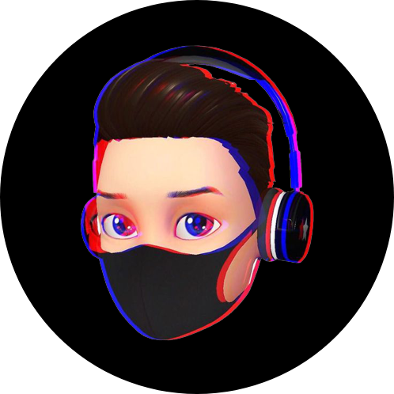

# portfolio-v2
- Neumorphism UI inspired v3 and my present personal portfolio website written in html, css and javascript

## link: https://RedEdge967.github.io

## Preview
|Light mode|Dark mode|
|-|-|
|||

*Images may look different from the present look of this website. and this website is made from Shaikh Anas youtube video*

> You can use this website template as your website also. but please make sure you are forking and using this template. and don't forget to give a star to this repo...
